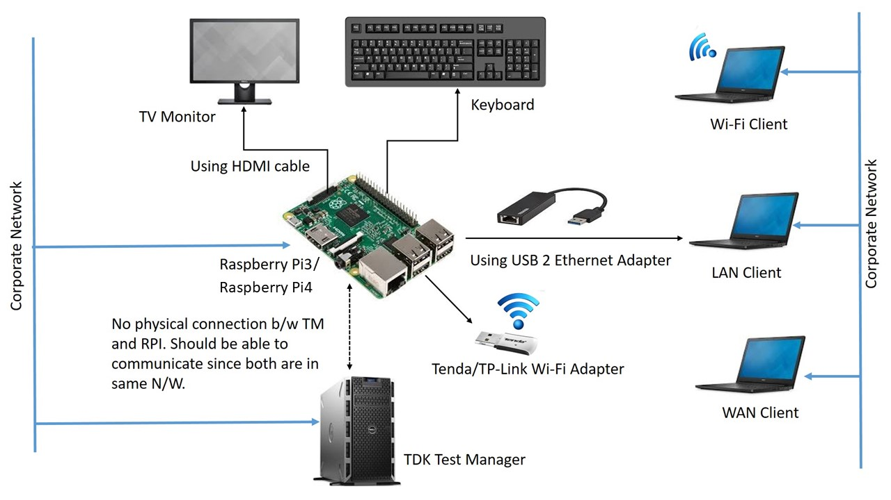
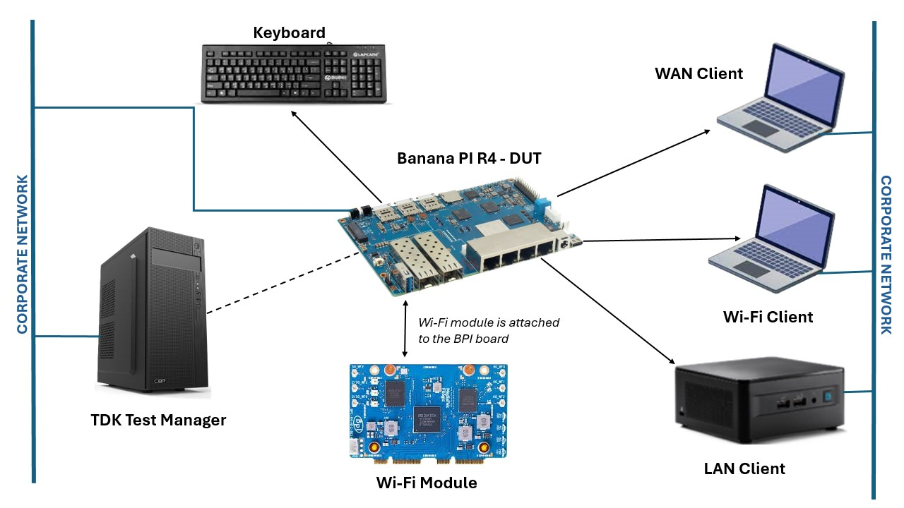
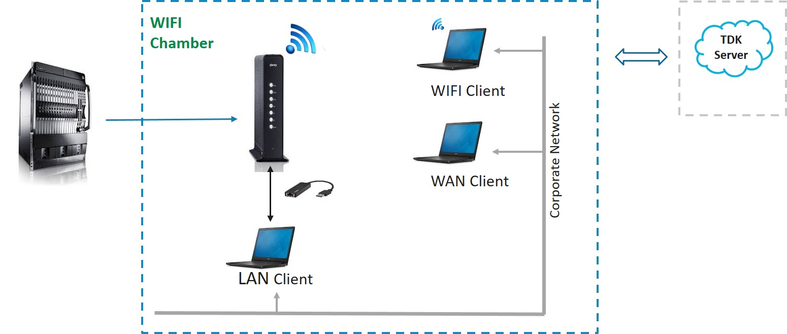
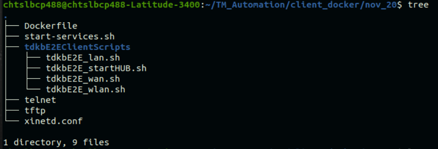

# TDK-B E2E Setup Document - With Client Docker Containers

---

## 1.1 TDK-B E2E Setup - Hardware Configuration

The following hardware components are used in the TDK-B E2E setup:

**Raspberry PI**



**Banana PI**



**Broadband Router**



> **Note:**
> - **WiFi Chamber:** Good to have in case a lot of WiFi interference is observed. Mainly the device under test and WiFi client need to be placed inside the WiFi chamber.
> - Client devices support is provided for Ubuntu 16.04, 18.04, 20.04, 22.04 (tested so far). Options are provided in the framework to support other client flavors like RPI / other Linux flavors / different versions — on request basis, the framework will be enhanced.

---

## 1.2 Hardware Requirements

- Test Manager machine (Ubuntu)
- LAN Client — RPI/Laptop (Ubuntu 16.04 / 18.04 / 20.04 / 22.04)
- WAN Client — RPI/Laptop (Ubuntu 16.04 / 18.04 / 20.04 / 22.04)
- WLAN Client — RPI/Laptop (Ubuntu 16.04 / 18.04 / 20.04 / 22.04)
- Device under test — RPI/BPI

> **Note:**
> - Currently E2E test scripts are validated only with client devices as separate Linux systems. Virtual Machines can also be used as LAN/WAN client devices if each VM has a different IP (not validated). For WiFi client, it should have an external WiFi adapter (not validated).
> - In case of WLAN client as a laptop, a WiFi driver with dual band support will be available by default. In case of WLAN client as any other system which supports only 2.4 GHz WiFi by default, an external 5 GHz WiFi adapter may be required.
> - In case of WLAN client which does not support 6 GHz WiFi by default, an external 6 GHz WiFi adapter may be required.
> - For 6 GHz testing that includes features related to OWE (Enhanced-Open security mode), it is recommended to use Ubuntu 22.04 or later for the WLAN client, as earlier Ubuntu versions may not fully support OWE.

---

## 1.3 Software Requirements

### RPI Ubuntu Image

Download the RPI Ubuntu image: `ubuntu-mate-<version>-desktop-armhf-raspberry-pi` from the link below and bring the client device up.

- https://ubuntu-mate.org/raspberry-pi/

---

### Steps to Follow While Building the Docker Image

Use the following folder structure while building the Docker image:



**Setup files:** [Dockerfile](setup_files/Dockerfile), [start-services.sh](setup_files/start-services.sh), [telnet](setup_files/telnet), [tftp](setup_files/tftp), [xinetd.conf](setup_files/xinetd.conf)

1. Place the `Dockerfile`, `start-service.sh`, `telnet`, `tftp`, `xinetd.conf`, and [`tdkbE2EClientScripts`](https://code.rdkcentral.com/r/plugins/gitiles/rdk/tools/tdk/+/refs/heads/rdk-next/framework/web-app/fileStore/tdkbE2EClientScripts/) in the same folder as shown in the picture above.

2. Before building the image, specify the username and password for clients in the `start-service.sh` file.

   > **Note:** The username configured in `start_service.sh` should **not** be the same as the host username. You can choose any username as it is the username for clients.

   ```bash
   # Set username and password
   USERNAME="client_tdkb"
   PASSWORD="********"
   ```

3. Build the Docker image with the following command:

   ```bash
   sudo docker build -t <name-of-the-docker-image> .
   ```

   > **Note:** You can use any name for the Docker image.

4. After completing the build process, verify that the Docker image has been created:

   ```bash
   sudo docker images
   ```

   > **Note:** On a new system, Docker commands may require `sudo` permissions. Use `sudo` with Docker commands or run them as the root user. You can also add Docker to the sudo group by referring to: https://askubuntu.com/questions/477551/how-can-i-use-docker-without-sudo

5. Once the Docker image build is complete, place the Docker image on all the client systems.  
   Use the `docker save` and `docker load` commands to transfer the Docker image to the client systems, or build the Docker image directly on the client system by following the steps above.

---

### Steps to Create Docker Container in WLAN Client System

After placing the Docker image on the WLAN client system:

1. Before proceeding, ensure that services like SSH, Apache2, vsftpd, and xinetd are **stopped** on the host system.
2. Disable FTP, HTTP, HTTPS, and TELNET ports on the host machine (use `systemctl` commands) before creating the Docker container.

3. Create the container using the following command:

   ```bash
   sudo docker run --network host --privileged \
     -v /var/run/dbus:/var/run/dbus \
     -v /var/run/NetworkManager:/var/run/NetworkManager \
     -v /etc/NetworkManager:/etc/NetworkManager \
     <image-name>
   ```

4. Verify the container has been created:

   ```bash
   sudo docker ps
   ```

5. Log in to the container:

   ```bash
   sudo docker exec -it <Container-ID> bash
   ```

6. Switch to the user created in the container:

   ```bash
   su <Username-specified-in-start-services.sh>
   ```

---

### Steps to Create Docker Container in LAN and WAN Systems

After placing the Docker image on the LAN and WAN client systems:

1. Before proceeding, ensure that services like SSH, Apache2, vsftpd, and xinetd are **stopped** on the host system.
2. Disable FTP, HTTP, HTTPS, and TELNET ports on the host machine (use `systemctl` commands) before creating the Docker container.

3. Create the container using the following command:

   ```bash
   sudo docker run -d --privileged --network host <image-name>
   ```

4. Verify the container has been created:

   ```bash
   sudo docker ps
   ```

5. Log in to the container:

   ```bash
   sudo docker exec -it <Container-ID> bash
   ```

6. Switch to the user created in the container:

   ```bash
   su <Username-specified-in-start-services.sh>
   ```

After the containers are created on the client systems, the containers will act as clients. Test script execution can begin after updating the device config file.

---

## 1.4 WiFi Client Setup

Ensure the following commands are working after the basic installations are done in the WLAN client.

**1. Check whether the WiFi SSIDs are listed in the WiFi networks:**

```bash
nmcli device wifi list | grep <SSIDNAME>
# Example:
nmcli device wifi list | grep "RDKB_RPI-AP0"
```

**2. Connect to one of the SSIDs listed in the WiFi network:**

```bash
nmcli device wifi connect <SSIDNAME> password <PASSWORD>
# Example:
nmcli device wifi connect RDKB_RPI-AP0 password password-2g
```

**3. Disconnect from the connected SSID:**

```bash
nmcli device disconnect <WLAN_INTERFACE>
# Example:
nmcli device disconnect wlan0
```

---

> **Note:** Device Configuration File (sampleDevice.config) details are covered separately in the Execution Guide.

---

## Note

- If you see bulk failures in end to end scripts related to disabling WiFi SSID/Radio, please make sure your WiFi client machine's auto-connect feature is disabled. These test scripts try to disable the gateway's SSID/Radio interface and will then attempt to communicate with other clients of the gateway, from the WiFi client. Ideally, this connection attempt should fail, but if auto-connect is enabled in the client machine for the SSIDs of this gateway, the client machine will get an IP from the gateway and the test will fail.
