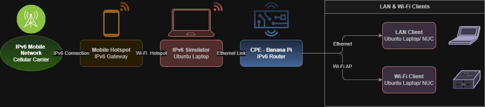

# TDK-B IPv6 Simulator Setup

---
## Table of Contents

[1. INTRODUCTION](#1-introduction)  
[2. IPv6 ENVIRONMENT DIAGRAM](#2-ipv6-environment-diagram)  
[3. UPSTREAM IPv6 CONNECTIVITY](#3-upstream-ipv6-connectivity)  
[4. DIBBLER SERVER SETUP IN IPv6 SIMULATOR](#4-dibbler-server-setup-in-ipv6-simulator)  
	[Prerequisites](#prerequisites)  
	[Step 1: Enable IPv6 Forwarding](#step-1-enable-ipv6-forwarding)  
	[Step 2: Assign IPv6 Address to the Simulator Interface](#step-2-assign-ipv6-address-to-the-simulator-interface)  
	[Step 3: Configure Dibbler DHCPv6 Server](#step-3-configure-dibbler-dhcpv6-server)  
	[Step 4: Clear Existing IPv6 Firewall Rules](#step-4-clear-existing-ipv6-firewall-rules)  
	[Step 5: Set Default IPv6 Firewall Policies to ACCEPT](#step-5-set-default-ipv6-firewall-policies-to-accept)  
	[Step 6: Restart Dibbler Server](#step-6-restart-dibbler-server)  
	[Step 7: Configure RADVD](#step-7-configure-radvd)  
	[Step 8: NAT66 and Forwarding Rules](#step-8-nat66-and-forwarding-rules)  
[5. IPv6 SIMULATOR INTERFACE VALIDATION](#5-ipv6-simulator-interface-validation)  
[6. IPv6 VALIDATION IN BPI ROUTER](#6-ipv6-validation-in-bpi-router)  
[7. IPv6 VALIDATION IN CONNECTED CLIENTS OF BPI](#7-ipv6-validation-in-connected-clients-of-bpi)  
[8. ADDITIONAL DEBUG COMMANDS](#8-additional-debug-commands)  
[9. TDK-B IPv6 EXECUTION GUIDE](#9-tdk-b-ipv6-execution-guide)  


## 1. INTRODUCTION

The IPv6 Simulator Setup is designed to establish an IPv6-enabled test environment for validating IPv6 functionality in networks where native IPv6 connectivity is not available. In this configuration, the simulator connects to a mobile hotspot to obtain IPv6 connectivity and subsequently forwards the acquired IPv6 network to the BPI and its connected client devices.This document outlines the required configuration steps to set up the IPv6 simulation environment and perform IPv6 feature validation effectively.
 
_***Prerequisite***: The mobile SIM and network operator must support IPv6 and provide IPv6 connectivity through the hotspot connection._

## 2. IPv6 ENVIRONMENT DIAGRAM



## 3. UPSTREAM IPv6 CONNECTIVITY

- Step 1: Connect the Ubuntu laptop to the mobile hotspot or upstream Wi-Fi.
    ``` 
    $ nmcli device wifi list | grep -i iPhone
            2E:90:2C:1A:58:2C  iPhone                      Infra  44    270 Mbit/s  62      ▂▄▆_  WPA2 WPA3
    $ sudo nmcli device wifi connect iPhone password <password>
    Device 'wlp2s0' successfully activated with '3f16bc75-7375-4a93-999e-f84975a67444'.
    ```

- Step 2: Verify that <wifi interface> has a global IPv6 address.

    ```
    $ ifconfig wlp2s0
    wlp2s0: flags=4163<UP,BROADCAST,RUNNING,MULTICAST>  mtu 1500
            inet 192.168.210.176  netmask 255.255.255.0  broadcast 192.168.210.255
            inet6 2409:40f3:20d8:2d9a:b95b:8f78:7536:a030  prefixlen 64  scopeid 0x0<global>
            inet6 fe80::5b4f:8b28:fe30:fd2f  prefixlen 64  scopeid 0x20<link>
            inet6 2409:40f3:20d8:2d9a:8122:c82c:d7e:de94  prefixlen 64  scopeid 0x0<global>
            ether 3c:6a:a7:de:1e:67  txqueuelen 1000  (Ethernet)
            RX packets 4388  bytes 1203245 (1.2 MB)
            RX errors 0  dropped 0  overruns 0  frame 0
            TX packets 5065  bytes 743895 (743.8 KB)
            TX errors 0  dropped 0 overruns 0  carrier 0  collisions 0
    ```

## 4. DIBBLER SERVER SETUP IN IPv6 SIMULATOR

This section describes how to configure the Ubuntu laptop as the IPv6 simulator for BPI WAN testing. In this setup, the Ubuntu system provides DHCPv6 service through dibbler and sends Router Advertisements through radvd so that the BPI router can obtain both a WAN IPv6 address and a delegated prefix.

**Prerequisites**

- Connect the Ubuntu simulator Ethernet interface to the BPI WAN port to - provide IPv6 connectivity to the BPI WAN side.
- Ensure the following packages are installed on the Ubuntu simulator:

    ```
    sudo apt update
    sudo apt install dibbler-server radvd -y
    ```

- Required components:
    - dibbler-server for DHCPv6 address and prefix delegation
    - radvd for Router Advertisements
    - ip6tables support for IPv6 firewall handling


**Step 1: Enable IPv6 Forwarding**

Enable IPv6 packet forwarding on the Ubuntu simulator so traffic can be routed between interfaces.

```
sudo sysctl -w net.ipv6.conf.all.forwarding=1
```

**Step 2: Assign IPv6 Address to the Simulator Interface**

Assign a global IPv6 address to the Ethernet interface connected to the BPI WAN port.

```
sudo ip addr add 2001:db8:1111:0:d786:cc43:fe52:b748/64 dev <lan_interface_name>
            lan_interface_name : The interface connected to the BPI WAN port for providing IPv6 connectivity
```

**Step 3: Configure Dibbler DHCPv6 Server**

Update ```/etc/dibbler/server.conf``` with the DHCPv6 address pool, prefix delegation pool, and DNS servers. 

```
iface <lan_interface_name> {
class {
pool 2001:db8:1111::/64
}
pd-class {
pd-pool 2601:9c0:d00:1170::/60
pd-length 60
}
option dns-server 2001:4860:4860::8888,2000::ff,2000::fe
}
```

**Step 4: Clear Existing IPv6 Firewall Rules**

Flush existing IPv6 firewall and NAT rules before starting validation.

```
sudo ip6tables -F
sudo ip6tables -X
sudo ip6tables -t nat -F
```

**Step 5: Set Default IPv6 Firewall Policies to ACCEPT**

Set permissive IPv6 policies for the validation setup. Restore once IPv6 validation is completed.

```
sudo ip6tables -P INPUT ACCEPT
sudo ip6tables -P OUTPUT ACCEPT
sudo ip6tables -P FORWARD ACCEPT
```

**Step 6: Restart Dibbler Server**

Restart the DHCPv6 server after configuration changes.

```
sudo systemctl restart dibbler-server
```

**Step 7: Configure RADVD**

Install radvd if not already present, then configure Router Advertisements on the BPI-facing interface.

```
sudo tee /etc/radvd.conf << 'EOF'
interface <lan_interface_name> {
    AdvSendAdvert on;
    AdvManagedFlag on;
    AdvOtherConfigFlag on;
    MinRtrAdvInterval 3;
    MaxRtrAdvInterval 10;
    prefix 2001:db8:1111::/64 {
        AdvOnLink on;
        AdvAutonomous off;
    };
};
EOF
```

Restart the services:
 
```
sudo systemctl restart radvd
sudo systemctl restart dibbler-server
```

**Step 8: NAT66 and Forwarding Rules**

Configure NAT66 and forwarding rules so the BPI router can access the internet through the Ubuntu simulator’s upstream interface.

```
sudo ip6tables -t nat -A POSTROUTING -o wlp2s0 -j MASQUERADE
sudo ip6tables -A FORWARD -i <lan_interface_name> -o wlp2s0 -j ACCEPT
sudo ip6tables -A FORWARD -i wlp2s0 -o <lan_interface_name> -m state --state ESTABLISHED,RELATED -j ACCEPT
```
 
## 5. IPv6 SIMULATOR INTERFACE VALIDATION

This section verifies that the Ubuntu simulator is correctly configured to provide DHCPv6, Router Advertisements, and upstream IPv6 connectivity to the WAN interface of the BPI router.

Verify that the Ubuntu simulator LAN interface is up and have the expected IPv6 address.

```
$ ifconfig enx5ce931bd191b
enx5ce931bd191b: flags=4163<UP,BROADCAST,RUNNING,MULTICAST>  mtu 1500
        inet6 fe80::9d7a:c15e:6683:328a  prefixlen 64  scopeid 0x20<link>
        inet6 2001:db8:1111:0:d786:cc43:fe52:b748  prefixlen 64  scopeid 0x0<global>
        ether 5c:e9:31:bd:19:1b  txqueuelen 1000  (Ethernet)
        RX packets 0  bytes 0 (0.0 B)
        RX errors 0  dropped 0  overruns 0  frame 0
        TX packets 0  bytes 0 (0.0 B)
        TX errors 0  dropped 0 overruns 0  carrier 0  collisions 0

$ tail -10 /var/log/dibbler/dibbler-server.log
2026.06.18 09:05:17 Server Debug     Cache: Address 2001:db8:1111:0:86e1:11d8:a97f:a05a added for client (DUID=00:03:00:01:02:01:00:6a:6c:09).
2026.06.18 09:05:17 Server Debug     Cache: Prefix 2601:9c0:d00:1170:: added for client (DUID=00:03:00:01:02:01:00:6a:6c:09).
2026.06.18 09:05:17 Server Notice    Creating multicast (ff02::1:2) socket on enx5ce931bd191b/8 (enx5ce931bd191b/8) interface.
2026.06.18 09:05:17 Server Notice    Creating link-local (fe80::9d7a:c15e:6683:328a) socket on enx5ce931bd191b/8 interface.
2026.06.18 09:05:17 Server Info      Reconfigure support was not enabled.
2026.06.18 09:05:17 Server Debug     Cache: size set to 1048576 bytes, 1 cache entry size is 147 bytes, so maximum 7133 address-client pair(s) may be cached.
2026.06.18 09:05:17 Server Debug     Updated old (pre 0.8.4?) database: IA with ifindex=8 and no ifacename, updated to enx5ce931bd191b
2026.06.18 09:05:17 Server Debug     Increased pools usage: currently 1 address(es) and 1 prefix(es) are leased.
2026.06.18 09:05:17 Server Notice    Server begins operation.
2026.06.18 09:05:17 Server Notice    Accepting connections. Next event in 171919 second(s).
```

## 6. IPv6 VALIDATION

Using Banana PI (BPI) as reference device to demonstrate the DUT side checkpoints.

Verify that the BPI router receives IPv6 on the WAN interface from the Ubuntu simulator and assigns the delegated IPv6 prefix on the LAN interface.

```
#WAN interface
root@Filogic-GW:~# ifconfig erouter0
erouter0  Link encap:Ethernet  HWaddr 02:01:XX:XX:XX:XX
          inet6 addr: fe80::1:ff:fe6a:6c09/64 Scope:Link
          inet6 addr: 2001:db8:1111:0:86e1:11d8:a97f:a05a/128 Scope:Global
          UP BROADCAST RUNNING MULTICAST  MTU:1500  Metric:1
          RX packets:17935 errors:0 dropped:0 overruns:0 frame:0
          TX packets:13649 errors:0 dropped:0 overruns:0 carrier:0
          collisions:0 txqueuelen:1000
          RX bytes:2188109 (2.0 MiB)  TX bytes:3114677 (2.9 MiB)
#LAN interface
root@Filogic-GW:~# ifconfig brlan0
brlan0    Link encap:Ethernet  HWaddr 02:03:00:6A:6C:10
          inet addr:10.0.0.1  Bcast:10.0.0.255  Mask:255.255.255.0
          inet6 addr: fe80::3:ff:fe6a:6c10/64 Scope:Link
          inet6 addr: 2601:9c0:d00:1170:3:ff:fe6a:6c10/64 Scope:Global
          UP BROADCAST RUNNING MULTICAST  MTU:1500  Metric:1
          RX packets:15747 errors:0 dropped:0 overruns:0 frame:0
          TX packets:9351 errors:0 dropped:0 overruns:0 carrier:0
          collisions:0 txqueuelen:1000
          RX bytes:1266978 (1.2 MiB)  TX bytes:1665931 (1.5 MiB)

root@Filogic-GW:~# ping -6 -c 4 google.com
PING google.com (2404:6800:4007:82f::200e): 56 data bytes
64 bytes from 2404:6800:4007:82f::200e: seq=0 ttl=115 time=204.356 ms
64 bytes from 2404:6800:4007:82f::200e: seq=1 ttl=115 time=98.658 ms
64 bytes from 2404:6800:4007:82f::200e: seq=2 ttl=115 time=57.519 ms
64 bytes from 2404:6800:4007:82f::200e: seq=3 ttl=115 time=480.795 ms

--- google.com ping statistics ---
4 packets transmitted, 4 packets received, 0% packet loss
```

_Note: erouter0 is the WAN interface and brlan0 is the LAN interface of DUT_

## 7. IPv6 VALIDATION IN CONNECTED CLIENTS OF BPI

Verify that the LAN and Wi-Fi clients connected to the BPI router receive IPv6 addresses from the delegated prefix and can access IPv6 connectivity through the BPI router.


**LAN Client:**

```
$ ifconfig enx00e04c4928a8
enx00e04c4928a8: flags=4163<UP,BROADCAST,RUNNING,MULTICAST>  mtu 1500
        inet 10.0.0.119  netmask 255.255.255.0  broadcast 10.0.0.255
        inet6 2601:9c0:d00:1170:ce5:31fd:aee8:b17d  prefixlen 64  scopeid 0x0<global>
        inet6 fe80::ad83:fcf0:9d9c:2f9c  prefixlen 64  scopeid 0x20<link>
        inet6 2601:9c0:d00:1170:75ea:8a9f:2436:d6d  prefixlen 64  scopeid 0x0<global>
        inet6 2601:9c0:d00:1170::d9fc  prefixlen 128  scopeid 0x0<global>
        ether 00:e0:4c:49:28:a8  txqueuelen 1000  (Ethernet)
        RX packets 0  bytes 0 (0.0 B)
        RX errors 0  dropped 0  overruns 0  frame 0
        TX packets 0  bytes 0 (0.0 B)
        TX errors 0  dropped 0 overruns 0  carrier 0  collisions 0

$ ping -I enx00e04c4928a8 -6 -c 4 google.com
PING google.com(pnmaaa-ap-in-x0e.1e100.net (2404:6800:4007:804::200e)) from 2601:9c0:d00:1170:75ea:8a9f:2436:d6d enx00e04c4928a8: 56 data bytes
64 bytes from maa05s12-in-x0e.1e100.net (2404:6800:4007:804::200e): icmp_seq=1 ttl=114 time=202 ms
64 bytes from pnmaaa-ap-in-x0e.1e100.net (2404:6800:4007:804::200e): icmp_seq=2 ttl=114 time=225 ms
64 bytes from pnmaaa-ap-in-x0e.1e100.net (2404:6800:4007:804::200e): icmp_seq=3 ttl=114 time=146 ms
64 bytes from maa05s12-in-x0e.1e100.net (2404:6800:4007:804::200e): icmp_seq=4 ttl=114 time=72.7 ms

--- google.com ping statistics ---
4 packets transmitted, 4 received, 0% packet loss, time 3003ms
rtt min/avg/max/mdev = 72.748/161.332/224.909/58.672 ms
```

**WLAN Client:**

```
$ nmcli device wifi list | grep 6a6c09
        02:02:10:6A:6C:0D  BPI-RDKB-MLO-AP-6a6c09     Infra  1     270 Mbit/s  100     ▂▄▆█  WPA2 WPA3
        02:02:20:6A:6C:0E  BPI-RDKB-MLO-AP-6a6c09     Infra  44    405 Mbit/s  79      ▂▄▆_  WPA2 WPA3

$ sudo nmcli device wifi connect BPI-RDKB-MLO-AP-6a6c09 password ********
Device 'wlan0' successfully activated with 'bd6fc201-0d3a-472f-a6aa-70c8892f48e0'.

$ nmcli connection show | grep wlan0
BPI-RDKB-MLO-AP-6a6c09    bd6fc201-0d3a-472f-a6aa-70c8892f48e0  wifi      wlan0

$ ifconfig wlan0
wlan0: flags=4163<UP,BROADCAST,RUNNING,MULTICAST>  mtu 1500
        inet 10.0.0.240  netmask 255.255.255.0  broadcast 10.0.0.255
        inet6 2601:9c0:d00:1170::5e8f  prefixlen 128  scopeid 0x0<global>
        inet6 fe80::d3a9:b162:5d30:f290  prefixlen 64  scopeid 0x20<link>
        inet6 2601:9c0:d00:1170:8ad3:87e2:ff01:9c79  prefixlen 64  scopeid 0x0<global>
        inet6 2601:9c0:d00:1170:fffb:d125:4f00:d845  prefixlen 64  scopeid 0x0<global>
        ether d8:3a:dd:c0:90:2d  txqueuelen 1000  (Ethernet)
        RX packets 168440  bytes 26465539 (26.4 MB)
        RX errors 0  dropped 157  overruns 0  frame 0
        TX packets 409323  bytes 148864149 (148.8 MB)
        TX errors 0  dropped 0 overruns 0  carrier 0  collisions 0

$ ping -I wlan0 -6 -c 5 google.com
PING google.com(lcmaaa-ax-in-x0e.1e100.net (2404:6800:4007:810::200e)) from 2601:9c0:d00:1170:fffb:d125:4f00:d845 wlan0: 56 data bytes
64 bytes from maa05s06-in-x0e.1e100.net (2404:6800:4007:810::200e): icmp_seq=1 ttl=114 time=177 ms
64 bytes from maa05s06-in-x0e.1e100.net (2404:6800:4007:810::200e): icmp_seq=2 ttl=114 time=286 ms
64 bytes from lcmaaa-ax-in-x0e.1e100.net (2404:6800:4007:810::200e): icmp_seq=3 ttl=114 time=198 ms
64 bytes from maa05s06-in-x0e.1e100.net (2404:6800:4007:810::200e): icmp_seq=4 ttl=114 time=238 ms
64 bytes from maa05s06-in-x0e.1e100.net (2404:6800:4007:810::200e): icmp_seq=5 ttl=114 time=87.8 ms

--- google.com ping statistics ---
5 packets transmitted, 5 received, 0% packet loss, time 4004ms
```

## 8. ADDITIONAL DEBUG COMMANDS

Use these commands only when the simulator is not assigning IPv6 correctly, dibbler is reusing stale lease information, or the Ethernet profile configuration is interfering with the test.

**Issue 1: Dibbler may be using old DHCPv6 lease/cache data, which can prevent fresh IPv6 address or prefix assignment to the BPI router**

```
sudo systemctl stop dibbler-server
sudo cp -r /var/lib/dibbler /var/lib/dibbler_backup
sudo rm -f /var/lib/dibbler/server-AddrMgr.xml
sudo rm -f /var/lib/dibbler/server-cache.xml
sudo rm -f /var/lib/dibbler/server-CfgMgr.xml
sudo rm -f /var/lib/dibbler/server-duid
sudo rm -f /var/lib/dibbler/server-IfaceMgr.xml
sudo rm -f /var/lib/dibbler/server-TransMgr.xml
sudo systemctl restart dibbler-server
```

**Issue 2: NetworkManager may be automatically managing the simulator Ethernet interface and interfering with the manual IPv6 configuration used for testing**

```
nmcli con show "Wired connection 4" | grep -E "ipv4|ipv6"
sudo nmcli con modify "Wired connection 4" \
    ipv4.method disabled \
    ipv6.method link-local
```


## 9. TDK-B IPv6 EXECUTION GUIDE

- For TDK-B IPv6 scripts execution, the Test Manager (TM) must be connected to the BPI as a LAN client to ensure that the BPI is properly detected and remains available within TM.

- The BPI is configured in Test Manager using the brlan0 interface IP address(10.0.0.1).
