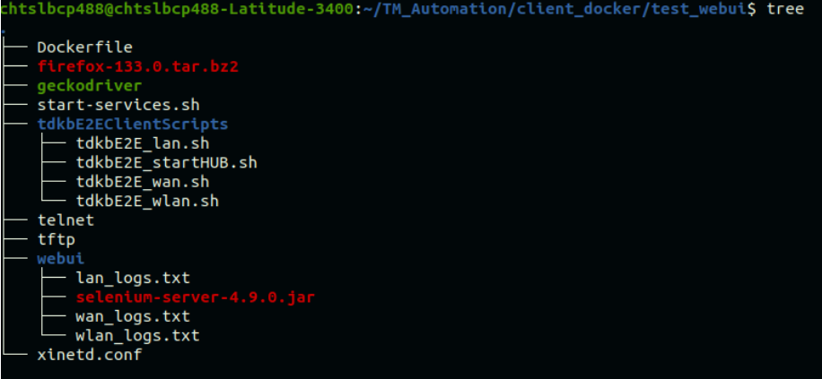

# TDK-B WebUI Test Framework - With Client Docker Containers

---

## 1.1. Overview

TDKB WebUI test suite is developed to test the UI functionalities of the Gateway device. TDK has the test scripts which performs the testing and validation of UI functionalities using Selenium Grid with Python.

- The test scripts are developed with the assumptions that 
    1. All client machines are Linux machines with Ubuntu 22.04
    2. The UI is opening in the Firefox browser
    3. All pre-requisites are satisfied

## 1.2. Steps to follow

- In our current end-to-end WebUI setup, The test manager runs on the host system, while separate WLAN, LAN, and WAN clients are used for testing. All required software installations and configurations for clients are performed manually on the host system. In the updated setup, we are automating the software installation and configuration using a Dockerfile.
- Dockerfile will be used to create webui docker containers in the WLAN, LAN, and WAN clients.
- Once webui setup(test manager and docker client container is running) is deployed in the host system to access test manager from another system use ```ssh -p 2222 username@host_ip``` command

- Please follow the folder structure below to build docker image for webui setup. 

    

Setup files: [Download the setup files](downloads/webui/E2E_Webui_setup.tar)


- Place the Dockerfile , start-service.sh, telnet, tftp, xinetd.conf, [tdkbE2EClientScripts](https://github.com/rdkcentral/tdk-core/tree/main/framework/fileStore/tdkbE2EClientScripts) folder, firefox-133.0.tar.bz2 and webui folder in the same folder as show in the above picture.
- Selenium-server jar file and client log files are placed in webui folder
- Download the latest version of Firefox based on your system architecture(_firefox-133.0.tar.bz2_) for Linux from [Download Firefox](https://www.mozilla.org/enUS/firefox/linux/) and place it in the same folder as shown in the above picture.
- Before building the image specify the username and password for clients in start-service.sh file.

    _Note: username to be configured in start_service.sh should not be the same as the host username. You can choose any username as it is username for clients._

    ```# Set username and password USERNAME="client_tdkb" PASSWORD="********"```

- Now build the docker image with the below command: 

    ```sudo docker build -t <name of the docker image> .```

- After completing the build process, verify that the Docker image has been created using the following command:
    
    ```sudo docker image .``` 

### 1.2.1. Steps to create docker container in client system(WLAN,LAN,WAN)

- Edit ```/etc/ssh/sshd_config``` on the host system and add Port 2222
Restart the SSH service.
- Allow traffic on port 2222 in host system using ```sudo ufw allow 2222/tcp``` or disable the firewall (ufw) in the host system using ```sudo ufw disable```.
- Now create client containers in the host system using below command, ensuring required services (HTTPS, HTTP, FTP, etc.) are stopped except SSH.
    
    > sudo docker run -d --network host --privileged -v /var/run/dbus:/var/run/dbus -v /var/run/NetworkManager:/var/run/NetworkManager -v /etc/NetworkManager:/etc/NetworkManager -e DISPLAY=:99 <image-name>

- We can verify if the container has been created using the following command:
sudo docker ps

- After the container is created, log in to the container using the following command: 
    
    ``` sudo docker exec –it <Container-ID> bash``` 

- After log in verify that ssh, Apache2, vsftpd, and xinetd services are running in the docker container. If not, start them using ```service <service-name> start``` command
- After this, log in to the user created in the container using the following command:
    
    ```su  <Username which is specified in start-services.sh>```

- After docker container is created on client system it will act as clients(wlan,lan,wan) in broadband end to end webui setup

    1. Fill the values for configurable variables in [sampleDevice.config](https://github.com/rdkcentral/tdk-core/blob/main/framework/fileStore/tdkbDeviceConfig/sampleDevice.config).
    2. Make sure the default password of WebUI has changed before executing scripts.

## 1.3. Test Framework Components

The main components of WebUI test framework are:

1. The utility file tdkbWEBUIUtility.py
    - This file contains 4 apis.
        1. startHub()
            - This api invokes a shell script called start_hub_script.sh which is in Test Manager machine.
        2. initiateNode(clientType)
            - This api invokes the client scripts(tdkb_lan.sh or tdkb_wlan.sh) which internally starts the node in client machine.
        3. setProxy(profile)
            - This api is invoked only if proxy is needed for accessing WebUI. Pass the profile of firefox browser to the function. The function will set the values for network.proxy.type, network.proxy.http, network.proxy.http_port, network.proxy.socks_username, network.proxy.socks_password and network.proxy.no_proxies_on
        4. kill_hub_node(clientType)
            - This is to kill the hub and node processes running in the machines. We cannot start the hub if it is already running. So it is mandatory to kill the processes before exiting the script.
2. The shell script start_hub_script.sh
    - This shell script contains the apis to start the hub using selenium-server-4.9.0.jar. This api is invoked from startHub() in tdkbWEBUIUtility.py.
3. proxy.zip
    - This zip file is needed only if the browser needs proxy to open the UI page.This zip file will contain 2 files - [geckodriver.log](downloads/webui/geckodriver.log) and [background.js](downloads/webui/background.js).
    - Place this proxy.zip in the same path where the browser executable is downloaded.


## 1.4. Test Script Workflow

1. Import utility files _tdkbE2EUtility.py_ and _tdkbWEBUIUtility.py_ in test script
2. Check if the client connection is success or not by checking the range of client IP
3. Start Selenium Hub in TM machine by invoking _startHub()_
4. Start Selenium Node in client machine by invoking initiateNode(_ClientType_)
5. The variable _"isProxyEnabled"_ is used to check if the proxy is needed to open UI in browser. If proxy should set in browser invoke _setProxy(profile)_. This function will internally set all the proxy settings.
6. Set profile of Firefox and open the browser in the client machine using the command _webdriver.Remote(browser_profile=profile)_.
7. Open the url in the browser using _driver.get(url)_
8. Validate if the UI has opened in the browser by checking an element in the UI page. For that we use xpath. 
_driver.find_element_by_xpath("/html/body/div[1]/div[3]/div[3]/h1").text_ will give the string present in this particular xpath location. And we can compare this string with expected string.
9. Likewise we can do any operations like click in a button, get the value of a filed, insert values in some particular fields etc.
10. After doing the testing and validation quit from the browser using _driver.quit()_.
