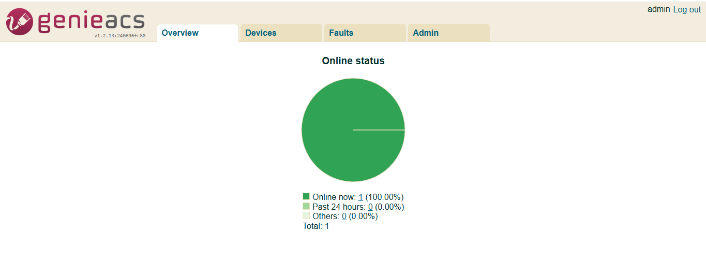
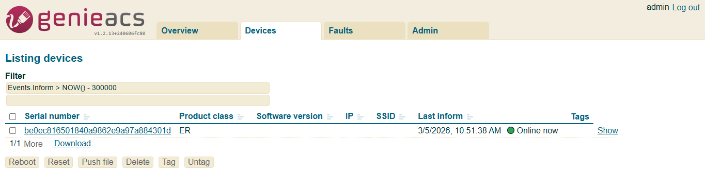
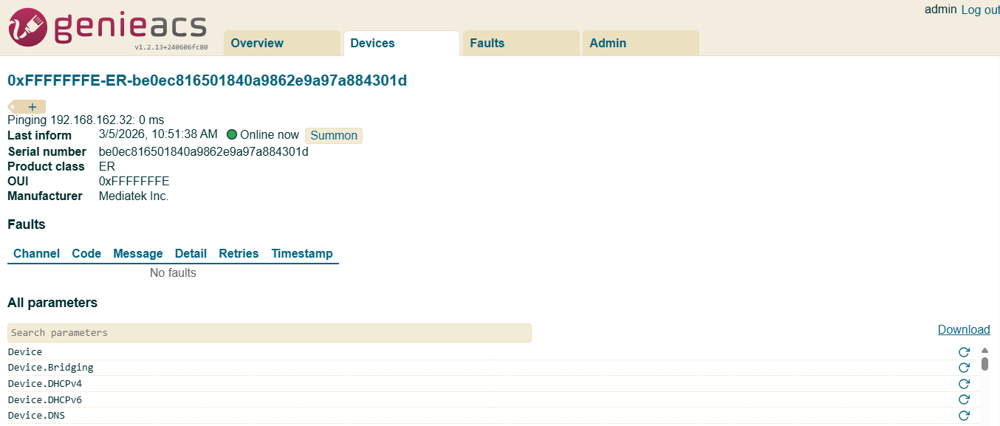

# TDK-B TR-069 Test Framework

## 1.1.1. Overview
**TR-069** (Technical Report 069), officially called: CPE WAN Management Protocol (CWMP) is a protocol defined by the **Broadband Forum** that allows an **ACS (Auto Configuration Server)** to remotely manage CPE devices like gateways.

## 1.1.2. Bringing-up of local ACS
TDK test framework for TR-069 is based on the open source **genieacs** - https://docs.genieacs.com/en/latest/installation-guide.html. Please follow the instructions in the installation guide to bring up a local ACS.

Ubuntu Host version:

```text
$ lsb_release -a
No LSB modules are available.
Distributor ID: Ubuntu
Description:    Ubuntu 22.04.5 LTS
Release:        22.04
Codename:       jammy
```

npm, Node.js and MongoDB versions:

```text
$ npm --version
8.5.1

$ nodejs --version
v12.22.9

$ mongod --version
db version v7.0.29
Build Info: {
  "version": "7.0.29",
  "gitVersion": "415cc13e900a82a2e00e4f4417dc7159a883e975",
  "openSSLVersion": "OpenSSL 3.0.2 15 Mar 2022",
  "modules": [],
  "allocator": "tcmalloc",
  "environment": {
    "distmod": "ubuntu2204",
    "distarch": "x86_64",
    "target_arch": "x86_64"
  }
}
```

By default, the following services will get installed in `/usr/local/bin`:

```text
genieacs-cwmp  genieacs-fs  genieacs-nbi  genieacs-ui
```

In the service files please change the line (example - genieacs-cwmp):

```ini
ExecStart=/usr/bin/genieacs-cwmp

to

ExecStart=/usr/local/bin/genieacs-cwmp
```

All service should be in active(running state):

```bash
sudo systemctl status genieacs-cwmp
sudo systemctl status genieacs-nbi
sudo systemctl status genieacs-fs
sudo systemctl status genieacs-ui
```

## 1.1.3. Genie ACS UI Familiarization
Accessing the UI `http://<acs-server-ip>:3000` for the first time will prompt for user account creation. Please follow the steps in the launch page to configure a user account.

Login the UI `http://<acs-server-ip>:3000` using username and password.

Some screenshots from GenieACS (https://genieacs.com) application are included for training purposes only.

**Overview Tab**: Displays the online status of devices if any.



**Devices Tab**: List details of devices that are online now.



Selecting any online devices will redirect to device details page having device details, tasks to be executed, faulty task entry any, list of supported parameters' details.

We can perform different operations such refresh, set, get via UI.



## 1.1.4. Prerequisite for DUT before executing scripts
Check if Tr069 Protocol Agent should be up and running.

```text
systemctl status CcspTr069PaSsp.service
CcspTr069PaSsp.service - CcspTr069PaSsp service
   Loaded: loaded (/lib/systemd/system/CcspTr069PaSsp.service; enabled; vendor preset: enabled)
   Active: active (running)
```

Check for the CcspTr069PaSsp is active and listening to port 7547:

```text
netstat -tlpnu | grep 7547
tcp        0      0 0.0.0.0:7547      0.0.0.0:*      LISTEN      6696/CcspTr069PaSsp
```

## 1.1.5. Prerequisite for connecting the DUT to genieacs server (Handled in the script)

```bash
dmcli eRT setv Device.ManagementServer.EnableCWMP bool true
dmcli eRT setv Device.ManagementServer.URL string http://<acs-server-ip>:7547/
dmcli eRT setv Device.DeviceInfo.X_RDKCENTRAL-COM_Syndication.TR69CertLocation string "/etc/cacert.pem"
```

Once the device is connected to the genieacs server, it will get connection request name that will uniquely identify the DUT in the server:

```bash
dmcli eRT getv Device.ManagementServer.ConnectionRequestUsername
```

## 1.1.6. Sanity check : TDK TM and GenieACS server
1. Note the container id of TDK Test Manager via `docker ps` command.
2. Get into the TDK docker and execute manually.

```bash
docker exec -it <TDK-containerID> bash
```

3. Check with a GET task request:

```bash
curl -i 'http://<acs-server-ip>:7557/devices/<device-id>/tasks?connection_request' -X POST --data '{"name":"getParameterValues", "parameterNames": ["Device.DeviceInfo.Manufacturer"]}'
```

Should return 200 as status code and non-empty response.

If successful, TDK docker and Genie ACS are able to communicate with each other.

## 1.1.7. Test framework Components
The main components of Tr069ACS test framework are:

1. The config file **trConfig.py** (existing file):
   It has information like acs server url, acs nbi url and tr069 certificate location.
2. The utility file **tr69ACSUtility.py** (new file):
   This library contains APIs:
   - **tr069ACSPreRequisite()**:
     This api will set `Device.ManagementServer.EnableCWMP`, `Device.ManagementServer.URL` and `Device.DeviceInfo.X_RDKCENTRAL-COM_Syndication.TR69CertLocation` to true, `http://<acs-server-ip>:7547/` and `/etc/cacert.pem` respectively via HTTP request. Thus establishing connection between DUT and ACS server. Then, it will retrieve `ConnectionRequestUsername` (device-id/username) that is used in the request query for uniquely identify the DUT that confirms device is connected to ACS server.
   - **gettr069ACS()**:
     This api will send GET TASK for getting parameter details from DUT, later send search query to search DB and then retrieve the value of the parameter from search query response.
   - **getTr181DMValue()**:
     This api will retrieve the value of the parameter from the DUT directly via TR181 Get stub.
   - **settr069ACS()**:
     This api will send SET task request to set the value of the parameter to another value via HTTP request.
   - **tr069ACSQuery()**:
     This api will frame the request to GenieACS server based on the method used (get/set/search/RefreshObject) and number of parameters with unique device-id. Response will be having status code and json response.
   - **parseTR69ACSResponse()**:
     This will parse the search query response and retrieve the value of parameter.

## 1.1.8. Test Script Workflow
1. From the test script, call the `tr69ACSPreRequisite()` function which will do the configuration and confirms that setup is ready to execute tr069ACS scenarios and returns username that uniquely identify DUT in the server.
2. Based on the operation (GET/SET/SEARCH), `gettr069ACS()` or `settr069ACS()` will be called and which internally calls `tr069ACSQuery()` to send request and parse the response via utility function `parseTR69ACSResponse()` if any (search operation).
3. If the operation is RefreshObject, it will directly call `tr069ACSQuery` and perform the refresh operation.
4. Request should return status code as 200 and non-empty query response.
5. For get and set values, the value will compared with the value retrieved from the DUT directly using utility function `getTr181DMValue()`.

## 1.1.9. Curl Command Examples
### GET Task Request

```bash
curl -i 'http://<acs-server-ip>:7557/devices/<device-id>/tasks?connection_request' -X POST --data '{"name":"getParameterValues", "parameterNames": ["Device.X_CISCO_COM_DeviceControl.LanManagementEntry.1.LanMode","Device.DeviceInfo.Manufacturer"]}'
```

```text
HTTP/1.1 200 OK
GenieACS-Version: 1.2.13+240606fc80
Content-Type: application/json
Date: Wed, 18 Feb 2026 05:56:08 GMT
Connection: keep-alive
Keep-Alive: timeout=5
Transfer-Encoding: chunked

{"name":"getParameterValues","parameterNames":["Device.X_CISCO_COM_DeviceControl.LanManagementEntry.1.LanMode","Device.DeviceInfo.Manufacturer"],"device":"0xFFFFFFFE-ER-2ae41d8f325b4cc38f1faf055ddbe475","timestamp":"2026-02-18T05:56:06.908Z","_id":"6995547610f16fdd418b4a03"}
```

### SEARCH Query

```bash
curl -i 'http://<acs-server-ip>:7557/devices?query=%7B%22_id%22%3A%22<device-id>%22%7D&projection=Device.X_CISCO_COM_DeviceControl.LanManagementEntry.1.LanMode,Device.DeviceInfo.Manufacturer'
```

```text
HTTP/1.1 200 OK
GenieACS-Version: 1.2.13+240606fc80
Content-Type: application/json
total: 1
Date: Wed, 18 Feb 2026 05:54:44 GMT
Connection: keep-alive
Keep-Alive: timeout=5
Transfer-Encoding: chunked

[
  {"_id":"0xFFFFFFFE-ER-2ae41d8f325b4cc38f1faf055ddbe475","Device":{"DeviceInfo":{"Manufacturer":{"_object":false,"_timestamp":"2026-02-18T05:53:24.480Z","_type":"xsd:string","_value":"Mediatek Inc.","_writable":false}},"X_CISCO_COM_DeviceControl":{"LanManagementEntry":{"1":{"LanMode":{"_object":false,"_timestamp":"2026-02-18T05:53:24.480Z","_type":"xsd:string","_value":"bridge-static","_writable":true}}}}}}
]
```

### SET Task Request

```bash
curl -i 'http://<acs-server-ip>:7557/devices/<device-id>/tasks?connection_request' -X POST --data '{"name": "setParameterValues", "parameterValues" : [["Device.ManagementServer.UpgradesManaged", true], ["Device.Time.Enable", false], ["Device.Time.NTPServer1", "pool.ntp.org"]]}'
```

```text
HTTP/1.1 200 OK
GenieACS-Version: 1.2.13+240606fc80
Content-Type: application/json
Date: Wed, 18 Feb 2026 06:06:21 GMT
Connection: keep-alive
Keep-Alive: timeout=5
Transfer-Encoding: chunked

{"name":"setParameterValues","parameterValues":[["Device.ManagementServer.UpgradesManaged",true],["Device.Time.Enable",false],["Device.Time.NTPServer1","pool.ntp.org"]],"device":"0xFFFFFFFE-ER-2ae41d8f325b4cc38f1faf055ddbe475","timestamp":"2026-02-18T06:06:19.549Z","_id":"699556db472b3ef0efe4078e"}
```

### Refresh a particular parameter

```bash
curl -i 'http://<acs-server-ip>:7557/devices/<device-id>/tasks?timeout=3000&connection_request' -X POST --data '{"name": "refreshObject", "objectName": "Device.DeviceInfo.ProvisioningCode"}'
```

```text
HTTP/1.1 200 OK
GenieACS-Version: 1.2.13+240606fc80
Content-Type: application/json
Date: Thu, 19 Feb 2026 06:41:26 GMT
Connection: keep-alive
Keep-Alive: timeout=5
Transfer-Encoding: chunked

{"name":"refreshObject","objectName":"Device.DeviceInfo.ProvisioningCode","device":"0xFFFFFFFE-ER-2ae41d8f325b4cc38f1faf055ddbe475","timestamp":"2026-02-19T06:41:24.875Z","_id":"6996b0945117e4f6a4f42bec"}
```

### Refresh all parameters

```bash
curl -i 'http://<acs-server-ip>:7557/devices/<device-id>/tasks?timeout=3000&connection_request' -X POST --data '{"name": "refreshObject", "objectName": ""}'
```

```text
HTTP/1.1 202 Task faulted
GenieACS-Version: 1.2.13+240606fc80
Content-Type: application/json
Date: Thu, 19 Feb 2026 06:42:07 GMT
Connection: keep-alive
Keep-Alive: timeout=5
Transfer-Encoding: chunked

{"name":"refreshObject","objectName":"","device":"0xFFFFFFFE-ER-2ae41d8f325b4cc38f1faf055ddbe475","timestamp":"2026-02-19T06:41:36.437Z","_id":"6996b0a0472b3ef0efe40792"}
```

## 1.1.10. References
- [TR069 Support for Bananapi R4](https://wiki.rdkcentral.com/spaces/RDK/pages/355764044/TR069+Support+for+Bananapi+R4)
- [Genieacs API Reference](https://docs.genieacs.com/en/latest/api-reference.html)
