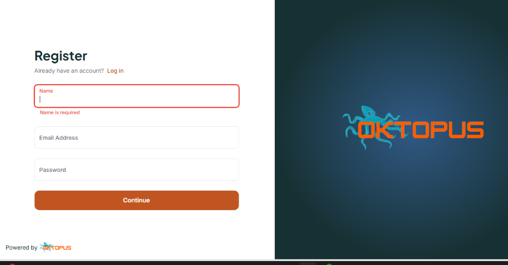
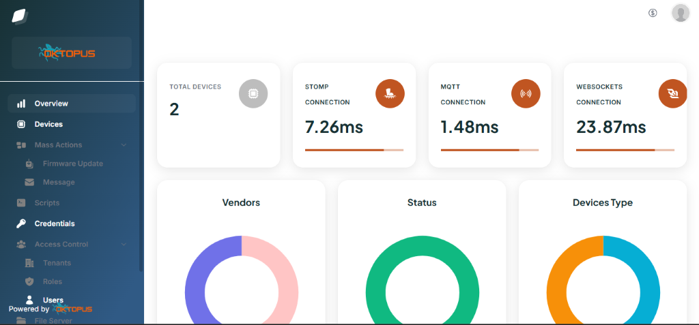
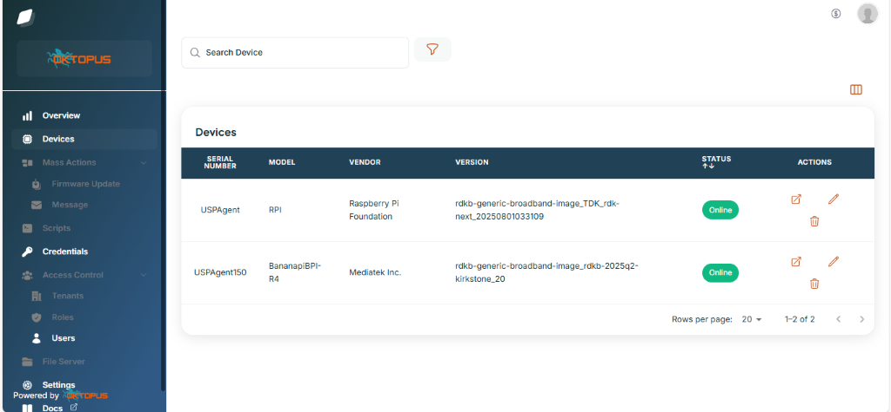
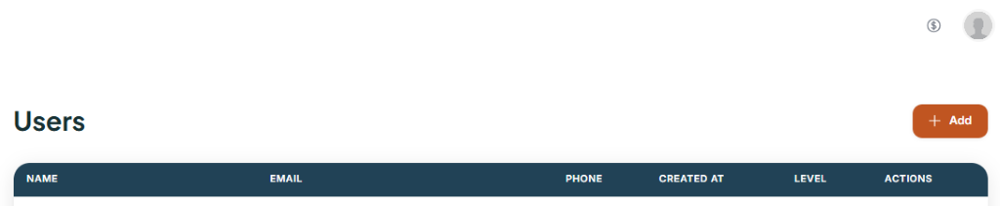

# TDK-B USPPA Test Framework

**Overview**

The User Services Platform(TR369) is a standardized protocol for managing, monitoring, upgrading, and controlling connected devices where management entities are separated between the Agent and the Controller.

USP Agent will be running in the EUT and exposes the device's Data Model (TR-181 objects) and executes commands. USP Controller runs on the cloud or a management system sends USP messages to configure, monitor, and control devices over Message Transfer Protocols(MTPs) like MQTT, STOMP, Websockets.

EUT (Endpoint Under Test) is used to refer DUT in USPPA context. Here, we use Oktopus Controller's Community version as USP controller for our test setup.

**Oktopus Controller (Community Edition) Installation**

**General Requirements:** docker, docker compose, wget, unzip
**Port Requirements** : https://docs.oktopus.app.br/getting-started/requirements/network

Please follow below steps:

1. wget https://github.com/OktopUSP/oktopus/archive/refs/heads/main.zip
2. unzip main.zip
3. cd oktopus-main/deploy/compose
4. chmod +x run.sh stop.sh
5. Modify the docker-compose.yaml file:

- Change the websocket ws container port from 8080 to 8008 since 8080 is already used by TDK docker. Ie, "8080:8080" should be replaced with "8008:8008" in the docker-compose.yaml file. (If controller and TDK TM docker hosted in the same machine)
- If VM doesn't support AVX, it may not support latest mongo 5+ and can crash the Mongo container.
- Check below command and see if its empty or not

```bash
lscpu | grep avx
```

If empty, It means AVX not supported, in turn Mongo 5+ is not supported.
**Workaround:**

In docker-compose.yaml file, downgrade the Mongo version:
Under mongo_usp details replace "image: mongo" with "image: mongo:4.4"

6. To start the docker

```bash
./run.sh
```

**Note :** Please make sure all containers say nginx, frontend, file-server, nats, portainer, socketio, stomp-adapter, mqtt-adapter, controller, adapter, ws-adapter, mongo_usp, websockets, mqtt, stomp are started successfully via docker ps command.

To stop all containers of Oktopus controller, Run below command

```bash
./stop.sh
```

**Controller and TDK TM docker should be hosted in the same machine or should be in the same network.**

**Sanity check : Oktopus Controller setup**

- Verify whether controller is up and running:
- Via VM:

```bash
curl --location 'http://localhost:8000/api/auth/admin/exists' --header 'Content-Type: application/json'
```

False ( since we haven't set any credentials yet )

- Via Browser: http://<VM-IP>/

**Basic Oktopus Controller UI Familiarisation**

Accessing UI for the first time will redirect to the admin Register page.
Sign up with mail ID. Save the email address and password to be used with the REST API calls.

NOTICE: Some screenshots from Oktopus (https://www.oktopus.app.br) application are included for training purposes only.



Once Logged in, Dashboard will having general details of Agents connected.



Under Devices, we can view details of configured devices, its active status. You can edit the device details, delete it and even access the device DMs and directly make the changes in selected EUT.



Under Users, you can add users. Rest apis can be accessed via admin as well as user credentials.



**Configuration of Agent/ EUT**

**Prerequisite:**

USPPA should be supported in EUT ie, usppa should be up and running:
pid of obuspa

**Modify below parameters in /etc/usp-pa/usp_factory_reset.conf file in EUT:**

```text
Device.LocalAgent.EndpointID "<AgentEndpointID>"      #Give some meaningful unique name, EUT will be identified by controller via this name and will used in the REST api calls eg:USPAgent
Device.LocalAgent.Controller.1.EndpointID "oktopusController"
Device.STOMP.Connection.1.Host "<Controller-IP>"      # IPV4 address of VM where Oktopus controller is hosted
Device.STOMP.Connection.1.Username ""                  #can be empty
Device.STOMP.Connection.1.Password ""                  # can be empty
Device.STOMP.Connection.1.EnableEncryption "false"     # mandatory step such that it will not look for any authentication
Device.UnixDomainSockets.UnixDomainSocket.1.Alias "cpe-2"  #its value shouldn't be same as Alias of stomp connection
Device.LocalAgent.MTP.2.Alias "cpe-2"                  # MTP 2 shouldn't have same alias name as MTP 1
```

**How to reflect changes in Factory reset file and restart the usppa:**

1. Stop usppa process:

```bash
systemctl stop usp-pa
```

2. Modify the /etc/usp-pa/usp_factory_reset.conf

3. Remove the usppa database (important):

```bash
rm /nvram/usp-pa.db
```

4. Start the usppa process

```bash
systemctl start usp-pa
```

5. Check the status

```bash
systemctl status usp-pa
```

If you want see the communication logs, you can stop the service and run the command

```bash
UspPa -p -v 4 -r /etc/usp-pa/usp_factory_reset.conf
```

**Note**: If you are modifying the factory reset file in the runtime board, need to do remove the usp-pa.db file and restart the usp-pa service.

Once the device configured successfully, it will listing Under Devices tab in controller UI within 5 mins.

**Sanity check : TDK TM and Controller Communication**

1. Note the container id of TDK Test Manager via docker ps command
2. Get into the TDK docker and execute manually

```bash
docker exec -it <TDK-containerID> bash
curl --location 'http://<Controller-ip>:8000/api/auth/admin/exists' --header 'Content-Type: application/json'
```

True ( as we already added admin credentials)

If successful, TDK docker and Oktopus docker are able to communicate with each other.

**Test framework Components**

The main components of USPPA test framework are:

1. The config file **usppaVariables.py**

It has information like, expected location of JWT token in the Controller hosted machine, and controller uri, username and password required for curl request formation.

Username and password can be the admin or user credential

2. The utility library **usppaUtility.py**

This library contains 3 apis:

- usppaQuery()

This api checks for JWT token in config file driven location. If not available or expired(24hrs), login and generate token. With the token and Agent's Endpoint ID, based on the message type/method frame the curl request to USP controller. It will return the status code and response value.

- ParseUsppaResponse()

This api will parse the response value and see if whether it adheres to the agent implementation specification for the respective method/message Type. It will return success if it matches the specification else failure.

- UsppaPreRequisite()

This api includes prerequisites required for usppa scripts to work successfully. It includes below checkpoints:

- Usppa process is up and running in the agent
- USP Controller is up and running in the hosted machine
- Get the Agent's EndpointID which is required for curl request formation. It also confirms that Controller is able to communicate with Agent.

**Test Script Workflow**

1. From the test script, call the UsppaPreRequisite() function which confirms the setup is ready to test usppa scenarios.
2. Inside usppaQuery(), checks for JWT token in config file driven location. If not available or expired(24hrs), login using username, password and controller Uri from config file usppaVariables.py and generate token. With the token and Agent's Endpoint ID, based on the message type/method frame the curl request to USP controller. It will return the status code and response value.
3. Test script then invokes the utility function parseUsppaResponse(), by passing the curl response from usppaQuery(), and the method type and number of tr-181 parameters involved in the query.
4. If the status code is 200/success, parseUsppaResponse() parse the response value and see if whether it adheres to the agent implementation specification for the respective method/message Type. It will return success if it matches the specification else failure.

**Curl Command Examples**

- **Check if admin exists or not**

```bash
curl --location 'http://<controller-ip>:8000/api/auth/admin/exists' --header 'Content-Type: application/json'
```

**Output**

```text
true
```

- **Login and get the token**

```bash
curl --location --request PUT 'http://localhost:8000/api/auth/login' --header 'Content-Type: application/json' --data-raw '{
"email":"<USERNAME>",
"password":"<PASSWORD>"
}'
```

**Output**

```text
"<JWT_TOKEN>"
```

- **Get Request**

```bash
curl --location -g --request PUT 'http://<controller-ip>:8000/api/device/<AgentID>/any/generic' --header 'Content-Type: application/json' --header 'Authorization: <JWT token>' --data '{"header": {"msg_id": "0289d955-326c-4081-903b-56881054c0ef","msg_type": "GET"},"body": {"request": {"get": {"param_paths": ["Device.WiFi.SSID.1.SSID" ]}}}}'
```

**Output**

```json
{"req_path_results":[{"requested_path":"Device.WiFi.SSID.1.SSID","resolved_path_results":[{"resolved_path":"Device.WiFi.SSID.1.","result_params":{"SSID":"RPI_RDKB-AP0"}}]}]}
```

**References:**

- [Oktopus installation](https://docs.oktopus.app.br/getting-started/installation)
- [oktopus USP Controller](https://wiki.rdkcentral.com/display/ASP/oktopus+usp+controller)
- [USP Standard](https://usp.technology/)
- [Oktopus controller API reference]( https://documenter.getpostman.com/view/18932104/2s93eR3vQY)